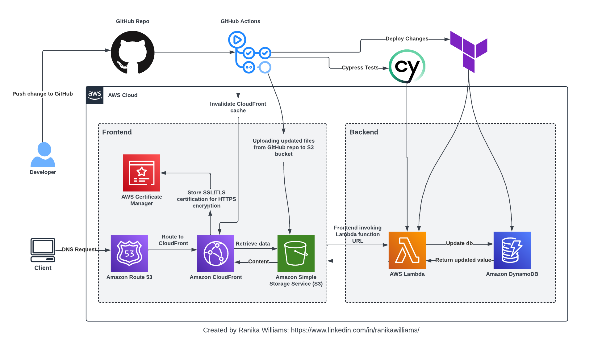

---

# Cloud Resume Challenge Project Backend

This project is a serverless full-stack web application built based on the [Cloud Resume Challenge](https://cloudresumechallenge.dev/). It consists of a front and backend hosted on AWS services, with infrastructure managed using Terraform. The CI/CD pipeline is implemented using GitHub Actions, and testing is conducted using Cypress. 

The frontend portion of this project can be found in this [repository](https://github.com/rnkwilliams/aws-cloud-resume-challenge-frontend). The deployed web app can be found [here](https://www.ranikaresume.com/).

## Architectural Diagram
This diagram explains the structure of the full-stack project:

## BackEnd

The application's backend utilizes AWS Lambda for serverless computing and DynamoDB for NoSQL database storage. Python(boto3) library is used for Lambda function development, enabling seamless interaction with DynamoDB. Whenever a user accesses the web application, a JavaScript function initiates an API call to the Lambda function. This call triggers the Lambda function, which retrieves an item from the DynamoDB table, increments the visit count attribute by one, and sends back the updated value in the response. The refreshed visit count is then displayed at the bottom of the web page.
Repository: [Backend GitHub Repository](https://github.com/rnkwilliams/aws-cloud-resume-challenge-backend)

## Infrastructure as Code (IaC)

The backend is built with Terraform, which manages infrastructure as code. This provides a declarative approach to provisioning and managing AWS resources such as Lambda functions and DynamoDB used in the project, ensuring consistent and reproducible deployments across environments.

## Continuous Integration/Continuous Deployment (CI/CD)

The backend employs GitHub Actions to automatically deploy modifications to the Terraform configuration files whenever code is pushed to this repository. Additionally, the workflow includes running end-to-end Cypress tests on the Lambda function to verify its functionality and ensure it returns valid data.

## Getting Started

To deploy the application, follow these steps:

1. Clone the front-end and back-end repositories.
2. Install dependencies for each component.
3. Set up Terraform with appropriate AWS credentials.
4. Configure GitHub Actions workflow for CI/CD.
5. Run tests using Cypress.
6. Deploy the application using Terraform.

## Contributing
Feel free to contribute, suggest improvements, or report issues by opening an issue or pull request on the GitHub repository.

## License
This project is licensed under the MIT License.

--- 
